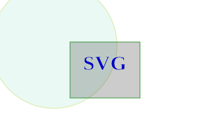

# kaSvg
## Lightweigth python SVG generation tool


This module contains all the classes required to easily create an xml
document containing svg diagrams.


such a code:
```python
def simple_example():

    from kaSvg import SvgWindow, XmlElement
    w = 300; h = 200; rw = 100; rh = 80; fh = 30
    window = SvgWindow(w, h, stroke_width='0.7px', background_color='#8AF')

    rect = XmlElement("rect", x=(w - rw) / 2, y=(h - rh) / 2,
                      width=rw, height=rh,
                      stroke="green", fill_opacity=0.2)

    circ = XmlElement("circle", cx=w * 0.2568, cy=h * 0.3234,
                      r=fh * 3, stroke="#deb", fill = "#bed",
                      stroke_width="1.3px", fill_opacity=0.3)

    text = XmlElement("text", x=w / 2, y=h / 2, text="SVG",
                      text_anchor="middle", font_size=fh,
                      style="font-family: Times New Roman; \
                      stroke: #deb; fill: #0000cd; font-weight:700;")

    window.append(circ)
    window.append(rect)
    window.append(text)

    window.store("_test_out/SimpleExample.svg")
```
generates such an image:




-------- | ---------------------------------
Author   | Michał Kaczmarczyk
Address  | Poland 
Contact  | use github contact form, please
Authors  | kamichal; aroberge (inspirator)
