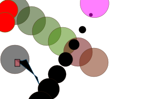

=====
kaSvg
=====
--------------------------------------
Lightweigth python SVG generation tool
--------------------------------------

This module contains all the classes required to easily create an xml
document containing svg diagrams.

.. bibliographic fields (which also require a transform):

:Author: Michał Kaczmarczyk
:Address: Poland 
:Contact: use github contact form, please
:Authors: kamichal; aroberge

